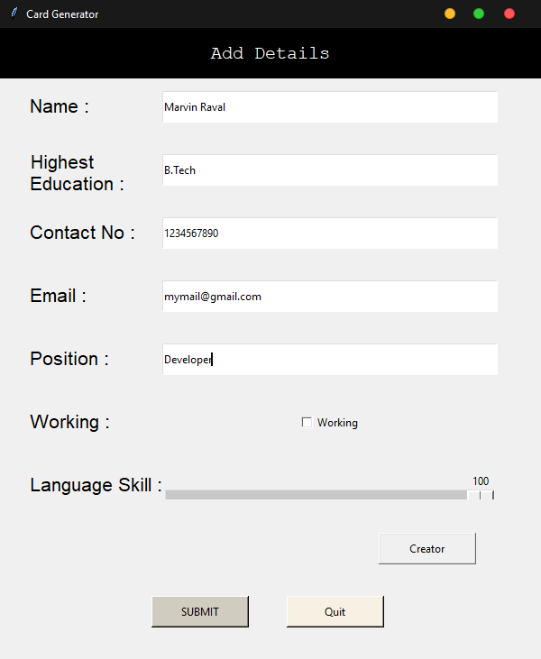

# Card-Generator-Using-Python
## A Fun Learning Program For Card Generation.

## It is for learnig purpose how to generate image using python, how to use tkinter and how to use multiple windows in tkinter.
## As it is time consuming to find image auto generation and use of multiple tkinter windows. 

Screenshots:

### Main Window to enter Information:

 

### Second Window With The Generated Card:

 

### The Saved Output:

 

The  Output Will be Saved on current directoy.

## Thanks For Visiting !
